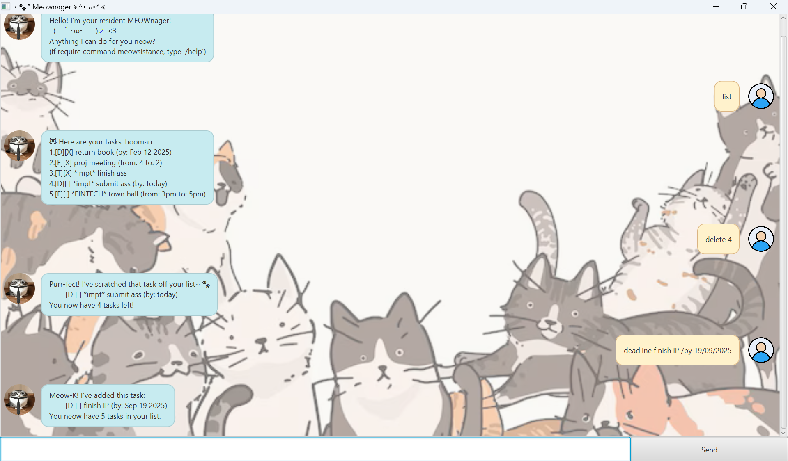

# 🐾 Meownager User Guide ≽^•⩊•^≼ ⋆°

---



---

> “Your mind is for having ideas, not holding them.” – David Allen ([source](https://dansilvestre.com/productivity-quotes))

## Your trusty Meownager is here to manage your tasks! 🐱

*Meownager is a task management application designed to help you organize your tasks efficiently. 
It offers a range of features to streamline your workflow and enhance productivity.*

It is:
- text-based
- easy to learn and use
- ~~FAST~~ SUPER FAST to use
  
Not only that, it is **FREE!**

### Want it? I know you do. 
All you have to do is:
1. download it from [here](https://github.com/llamawithhats/ip.git)
2. double click it
3. add your tasks
4. and let it meow-nage your tasks! 😸
5. (optional) read this guide to explore all the features! (or simply input /help to see all commands)

---

## Features

### Adding todo tasks

Input 'todo {task}'

Example: `todo read book`


```
Meow-K! I've added this task:
   [T][ ]  read book  
You neow have 1 tasks in your list.";
```

### Adding deadline tasks
Input 'deadline {task} /by {date time}'

Example: `deadline return book /by 1/12/2024 1800`
```
Meow-K! I've added this task:
   [D][ ]  return book (by: Dec 1 2024 6:00PM)
You neow have 2 tasks in your list.";
```
**NOTE:**  
* if input date is in the format _dd/MM/yyyy hhmm_, where time is in 24-hour format,
Meownager will convert it to a more human-readable format _MMM d yyyy hh:mm am/pm_.
* the time _hh:mm_ is optional. If not provided, Meownager will ignore the time.

### Adding event tasks
Input 'event {task} /from {date time} /to {date time}'

Example: `event project meeting /from 2pm /to 4pm`
```
Meow-K! I've added this task:
   [E][ ]  project meeting (from: 2pm to: 4pm)
You neow have 3 tasks in your list.";   
```

**NOTE:**
* input date in the format _dd/MM/yyyy hhmm_, where time is in 24-hour format,
  is not supported for event tasks.

### Listing tasks
Input 'list'

Example: `list`
```
😺 Here are your tasks, hooman:
1.[T][ ] read book
2.[D][ ] return book (by: Dec 1 2024 6:00PM)
3.[E][ ] project meeting (from: 2pm to: 4pm)
```

### Marking tasks as done
Input 'mark {task number}'

Example: `mark 2`
```
Meow! Good job completing this task:
   [D][X] return book (by: Dec 1 2024 6:00PM)
```

### Unmarking tasks as not done
Input 'unmark {task number}'    

Example: `unmark 2`
```
Meow! I've unmarked this task for you:
   [D][ ] return book (by: Dec 1 2024 6:00PM)
``` 

### Finding tasks
Input 'find {keywords}'

Example: `find book`
```
Paws up! I’ve sniffed out these matching tasks:
1.[T][ ] read book
2.[D][ ] return book (by: Dec 1 2024 6:00PM)
```

### Deleting tasks
Input 'delete {task number}'

Example: `delete 1`
```
Purr-fect! I’ve scratched that task off your list~ 🐾:
   [T][ ] read book
You now have 2 tasks left!";
```

### Adding tags to tasks
Include '/tag {tag msg}' when adding a task

Example: `todo read book /tag leisure`
```
Meow-K! I've added this task:
   [T][ ] *leisure* read book
You neow have 3 tasks in your list.";
``` 

### Deleting tags from tasks
Input 'deltag {task number}'

Example: `deltag 3`
```
Hehe, I've clawed away that tag~ 🐾 
This is your edited task:
    [T][ ] read book
```

### Editing / Introducing tags to existing tasks
Input 'edittag {task number} {new tag msg}'

Example: `edittag 2 urgent`
```
Meow! I've edited your tag message~ 
This is your edited task:
   [D][ ] *urgent* return book (by: Dec 1 2024 6:00PM)
``` 

### Finding tasks by tag only
Input 'findtag {tag msg}'

Example: `findtag leisure`
```
Paws up! I’ve sniffed out these matching tasks:
1.[T][ ] *leisure* read book
``` 

### Exiting Meownager
Input 'bye'

Example: `bye`
```
Meow you next time!
```
---


